# Домашнее задание к занятию «Введение в Terraform»
Выполнил: Береснев Игорь Андреевич

---

Задание 1

Перейдите в каталог src. Скачайте все необходимые зависимости, использованные в проекте.
Изучите файл .gitignore. В каком terraform-файле, согласно этому .gitignore, допустимо сохранить личную, секретную информацию?(логины,пароли,ключи,токены итд)
Выполните код проекта. Найдите в state-файле секретное содержимое созданного ресурса random_password, пришлите в качестве ответа конкретный ключ и его значение.
Раскомментируйте блок кода, примерно расположенный на строчках 29–42 файла main.tf. Выполните команду terraform validate. Объясните, в чём заключаются намеренно допущенные ошибки. Исправьте их.
Выполните код. В качестве ответа приложите: исправленный фрагмент кода и вывод команды docker ps.
Замените имя docker-контейнера в блоке кода на hello_world. Не перепутайте имя контейнера и имя образа. Мы всё ещё продолжаем использовать name = "nginx:latest". Выполните команду terraform apply -auto-approve. Объясните своими словами, в чём может быть опасность применения ключа -auto-approve. Догадайтесь или нагуглите зачем может пригодиться данный ключ? В качестве ответа дополнительно приложите вывод команды docker ps.
Уничтожьте созданные ресурсы с помощью terraform. Убедитесь, что все ресурсы удалены. Приложите содержимое файла terraform.tfstate.
Объясните, почему при этом не был удалён docker-образ nginx:latest. Ответ ОБЯЗАТЕЛЬНО НАЙДИТЕ В ПРЕДОСТАВЛЕННОМ КОДЕ, а затем ОБЯЗАТЕЛЬНО ПОДКРЕПИТЕ строчкой из документации terraform провайдера docker. (ищите в классификаторе resource docker_image )

### Скриншот Инициализации Terraform

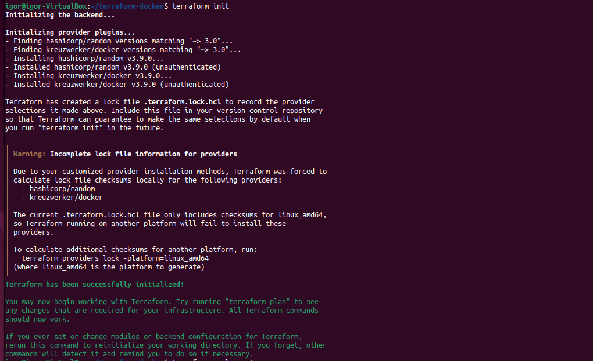

### Скриншот файла .gitignore

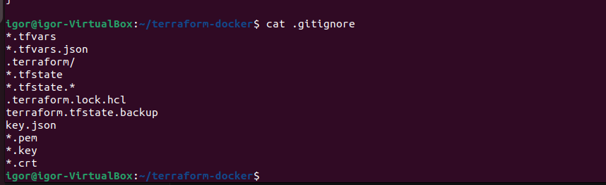

### Скриншот terraform apply + секрет в state

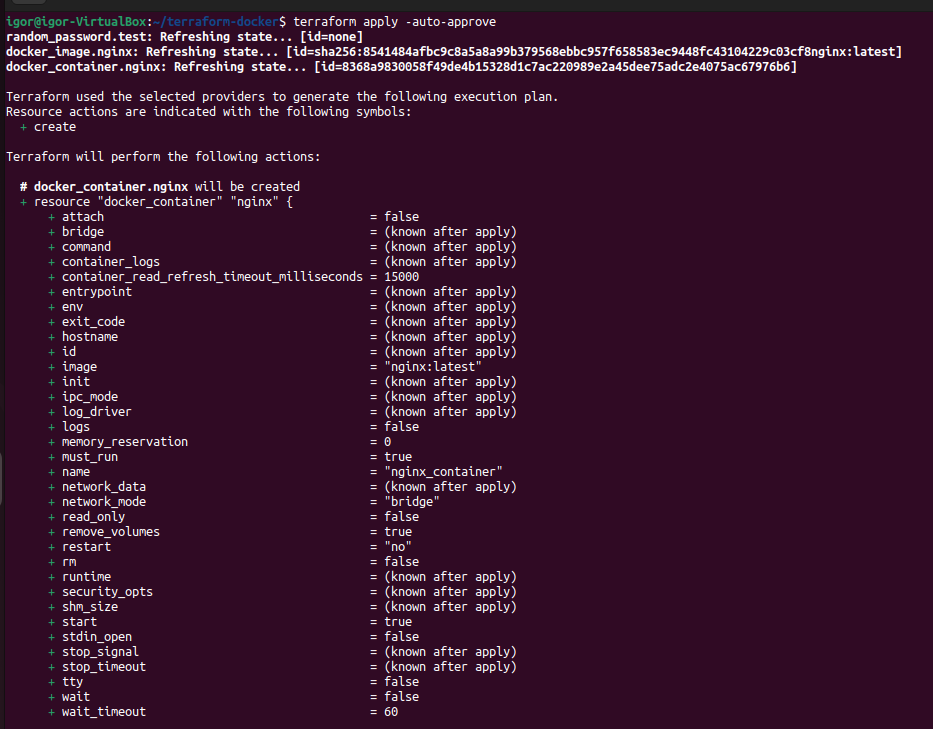

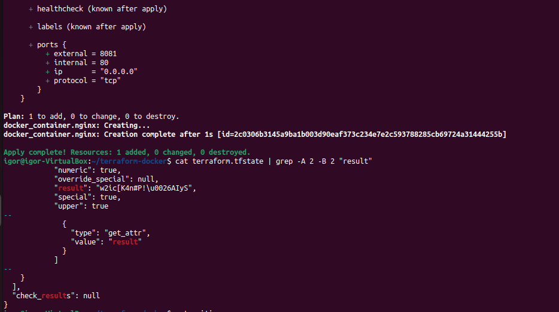

### Скриншот terraform validate с ошибками 

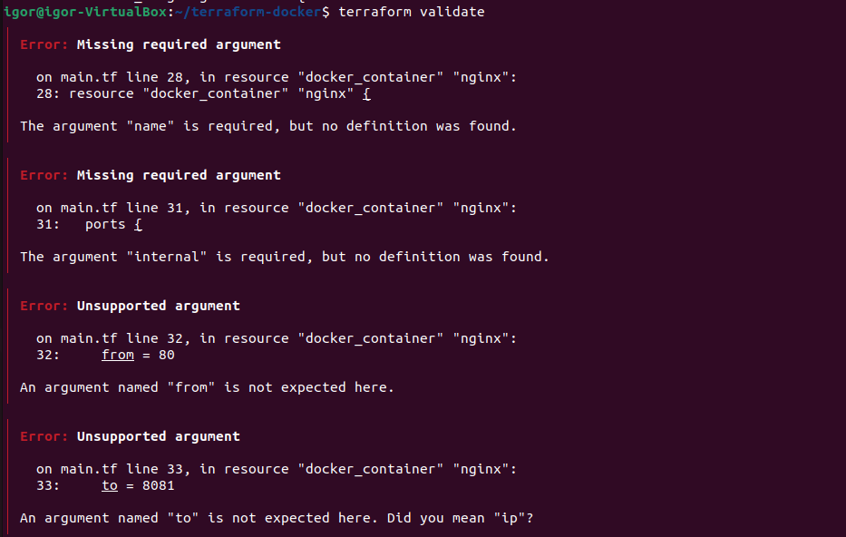

### Скриншот исправленного main.tf

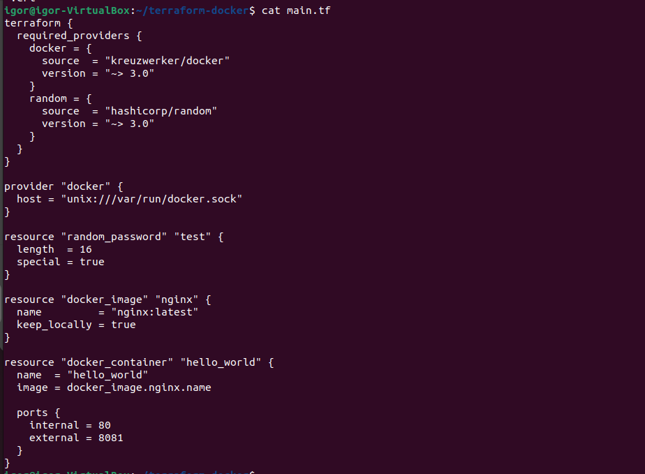

### Скриншот docker ps с hello_world

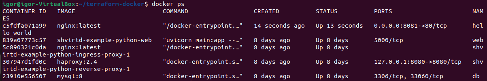

### Скриншот terraform destroy + пустой state

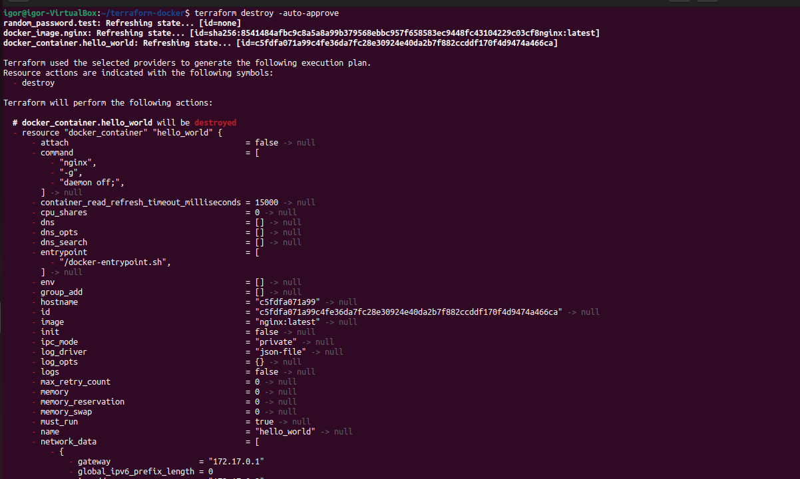

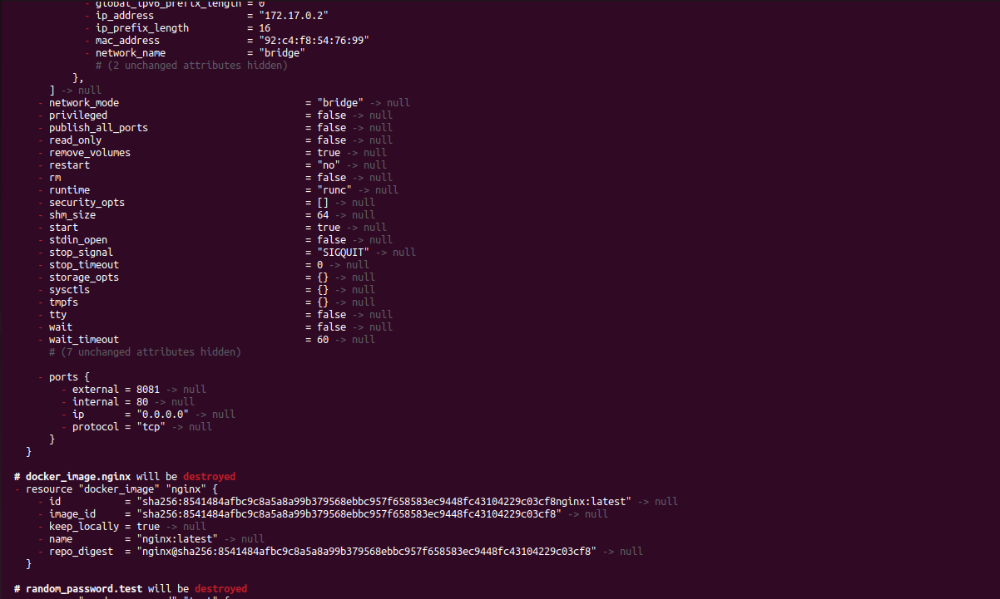

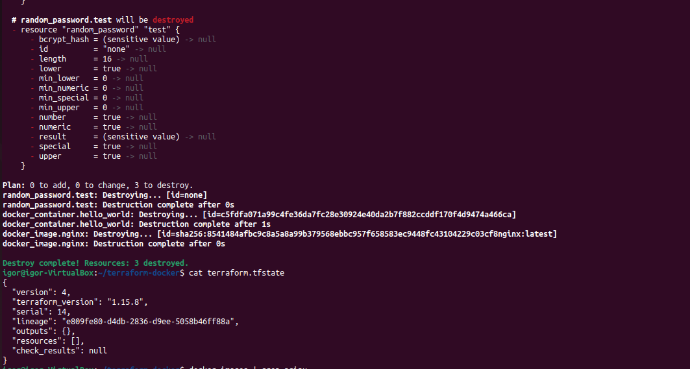

### Скриншот Образ nginx остался

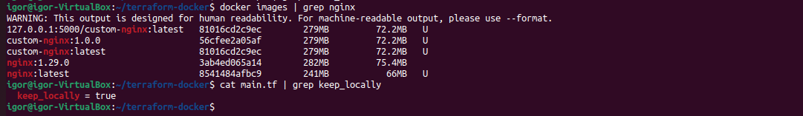
